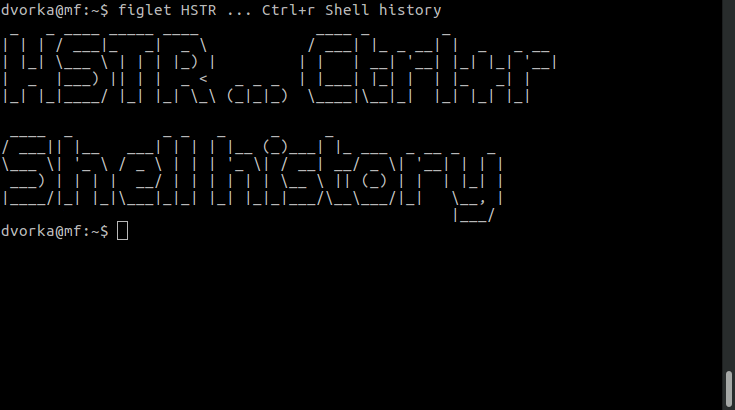

# HSTR

[](https://github.com/dvorka/hstr/actions)
[](https://github.com/dvorka/hstr/releases)
[](https://github.com/dvorka/hstr/issues)
[](https://github.com/dvorka/hstr/releases)
[](https://github.com/dvorka/hstr/blob/master/LICENSE)

Easily view, navigate and search your **command history** with shell history suggest box for 
[bash](https://www.gnu.org/software/bash/) and [zsh](CONFIGURATION.md#zsh-history-settings).

[](http://www.youtube.com/watch?v=sPF29NyXe2U)

## Description

Are you looking for a command that you used **recently**? Do you
want to  avoid the need to write **long commands** over and over
again? Are you looking for a tool that is able to manage your
**favorite** commands?

HSTR (**H**i**ST**o**R**y) is a command line utility that brings improved `bash`/`zsh` command completion
from the history. It aims to make completion **easier** and more **efficient** than <kbd>Ctrl-r</kbd>.

HSTR can also **manage** your command history (for instance you can remove
commands that are obsolete or contain a piece of sensitive information)
or **bookmark** your favorite commands.

<!-- Check [video](http://www.youtube.com/watch?v=sPF29NyXe2U) tutorial. -->

## Installation

Install:

* [Ubuntu](INSTALLATION.md#ubuntu)
* [Debian](INSTALLATION.md#debianmint)
* [Mint](INSTALLATION.md#debianmint)
* [Fedora](INSTALLATION.md#fedorarhelcentosscientific)
* [CentOS](INSTALLATION.md#fedorarhelcentosscientific)
* [RHEL](INSTALLATION.md#fedorarhelcentosscientific)
* [Scientific Linux](INSTALLATION.md#fedorarhelcentosscientific)
* [openSUSE](INSTALLATION.md#opensuse)
* [Gentoo](INSTALLATION.md#gentoo)
* [Alpine Linux](INSTALLATION.md#alpine-linux)
* [Arch](INSTALLATION.md#archmanjaro-linux)
* [Manjaro Linux](INSTALLATION.md#archmanjaro-linux)
* [FreeBSD](INSTALLATION.md#freebsd)
* [Slackware Linux](INSTALLATION.md#slackware)
* [Void Linux](INSTALLATION.md#void-linux)
* [Milis Linux](INSTALLATION.md#milis-linux)
* [Haiku OS](INSTALLATION.md#haiku-os)
* [macOS](INSTALLATION.md#macos)
* [nix package manager](INSTALLATION.md#nix-package-manager)
* [Guix package manager](INSTALLATION.md#guix-package-manager)
* [MPR package manager](INSTALLATION.md#mpr-package-manager)

Build:

* [build on any Linux distro](INSTALLATION.md#build-on-any-linux-distro)
* [build snap](INSTALLATION.md#snap)
* [build on Ubuntu](INSTALLATION.md#build-on-ubuntu)
* [build on Debian](INSTALLATION.md#build-on-debian)
* [build on Fedora](INSTALLATION.md#build-on-fedora)
* [build on Windows Subsystem for Linux (WSL)](INSTALLATION.md#build-on-wsl)
* [build on Cygwin](INSTALLATION.md#build-on-cygwin)
* [build on macOS](INSTALLATION.md#build-on-macos)

Tarball:

* [build and install tarball](INSTALLATION.md#build-and-install-tarball)

Check also [packages](https://pkgs.org/search/?q=hstr) for Linux and Unix.

## Configuration

Configure HSTR just by running:

```bash
# bash
hstr --show-bash-configuration >> ~/.bashrc

# zsh
hstr --show-zsh-configuration >> ~/.zshrc
```

For detailed HSTR configuration documentation please refer to [Configuration](CONFIGURATION.md).

## In the News

Read about HSTR in [LinuxMagazine](http://www.linux-magazine.com/Issues/2014/164/Bash-History-on-Steroids), [UbuntuGeek](http://www.ubuntugeek.com/tag/hstr-bash-history), [DebianAdmin](http://www.debianadmin.com/hstr-easily-view-navigate-search-and-use-your-command-history-with-shell-history.html), [Tuxdiary](http://tuxdiary.com/2015/02/17/hstr/), [Softpedia](http://linux.softpedia.com/get/Terminals/BASH-Command-History-Completion-103155.shtml) and [OSTechNix](https://www.ostechnix.com/hstr-easily-view-navigate-search-manage-commandline-history/).

## Documentation

Check man page:

```bash
man hstr
```

User videos: [Zack](https://www.youtube.com/watch?v=Qd75pIeQkH8), [Dvorka](https://www.youtube.com/watch?v=sPF29NyXe2U) and [Yu-Jie Lin](https://www.youtube.com/watch?v=Qx5n_5B5xUw).

## Bugs

https://github.com/dvorka/hstr/issues
